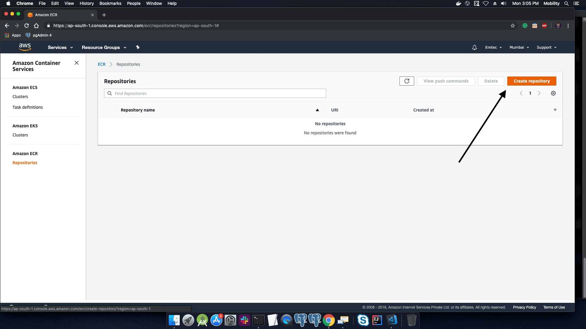
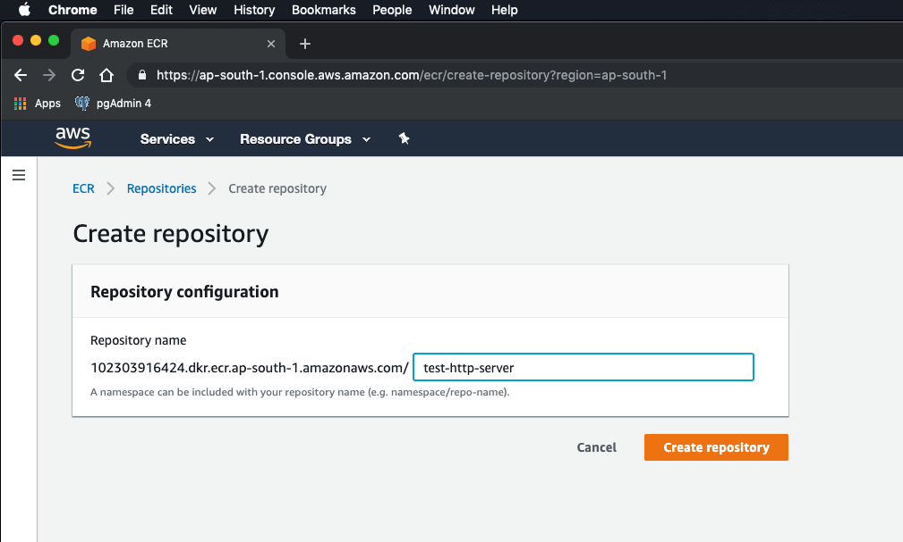
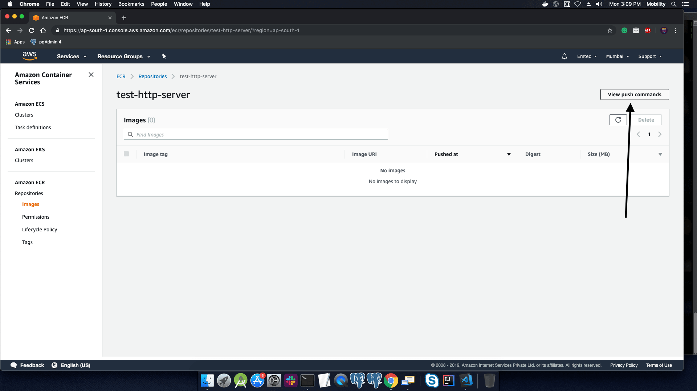
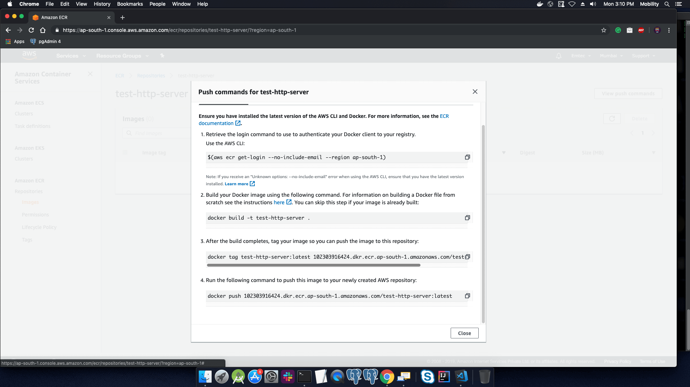
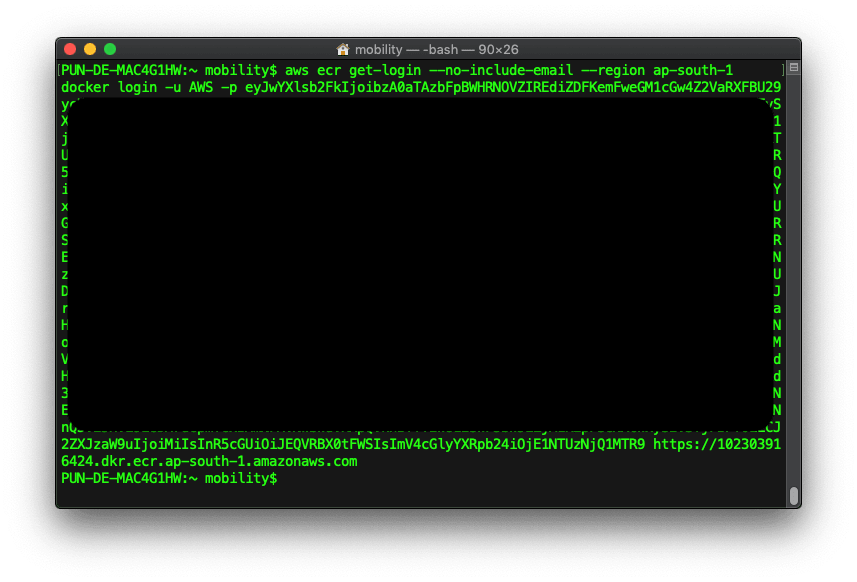

### Deploying a docker web application to AWS-ECS
### For those who had just started, we'll have a look at docker and ECS.

Docker is a tool designed to make it easier to create, deploy, and run applications by using containers. Containers allow a developer to package up an application with all of the parts it needs, such as libraries and other dependencies, and ship it all out as one package. By doing so, thanks to the container, the developer can rest assured that the application will run on any other Linux machine regardless of any customized settings that machine might have that could differ from the machine used for writing and testing the code.
In a way, Docker is a bit like a virtual machine. But unlike a virtual machine, rather than creating a whole virtual operating system, Docker allows applications to use the same Linux kernel as the system that they're running on and only requires applications be shipped with things not already running on the host computer. This gives a significant performance boost and reduces the size of the application.

Amazon Elastic Container Service (Amazon ECS) is a highly scalable, high-performance container orchestration service that supports Docker containers and allows you to easily run and scale containerized applications on AWS. Amazon ECS eliminates the need for you to install and operate your own container orchestration software, manage and scale a cluster of virtual machines, or schedule containers on those virtual machines.

### Creating a docker image

You can create a docker images by using Dockerfile or else you can create an image by configuring existing image manually.
I'll go with existing [httpd](https://hub.docker.com/_/httpd) image and configure it as i want, So let's start.

1.  Login to AWS and go to Services-> ECR, and create a ECR repository



2.  Give title to repository.
>   this title should be more specific. While downloading this image the same title is used with versions



3.  For command help you can use ```View push commands``` tab, which will include all commands used for uploading an image to your AWS repository



Popup will apear with some commands as follows



4.  Executing first command

```sh
aws ecr get-login --no-include-email --region ap-south-1
```



copy the output and execute that command, after that  message will appear.